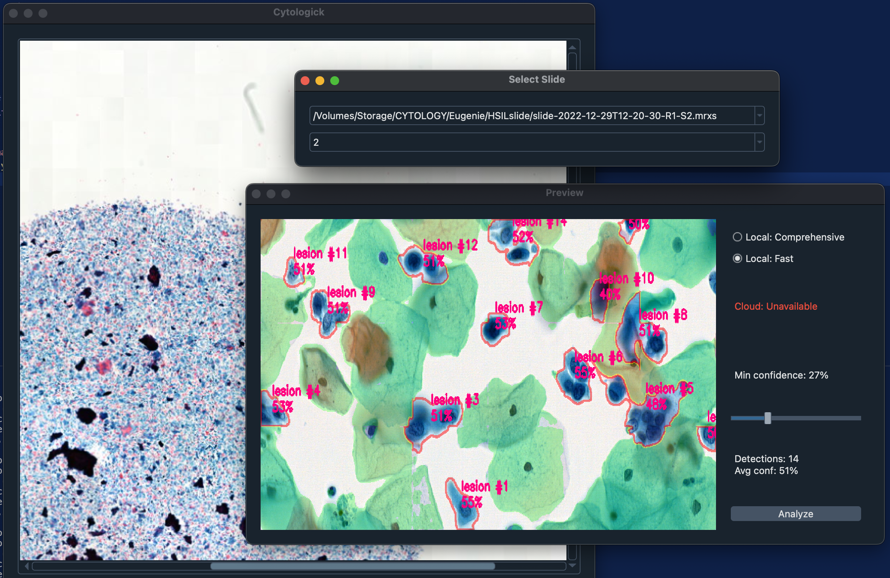

# Cytologick - Research Tool for Pap Smear Analysis

## What is Cytologick?

Cytologick is a Python-based research tool for analyzing Pap smear slides using artificial intelligence. This software is designed for research and educational purposes to explore automated detection of cellular abnormalities like LSIL, HSIL, and ASCUS in cytological samples.

## What it does

- Loads MRXS slide files
- Trains U-Net segmentation models on annotated cell data
- Supports both TensorFlow and PyTorch frameworks
- Provides Qt desktop interface for viewing slides
- Runs inference on slide regions
- Works with ASAP annotation files
- Detects LSIL, HSIL, ASCUS, and ASCH cell patterns  



## Installation

### Prerequisites

- [Conda](https://docs.conda.io/en/latest/miniconda.html) package manager
- [OpenSlide](https://openslide.org) for reading medical slide files

### Step 1: Create Python Environment

```bash
conda create -n cytologick python=3.10
conda activate cytologick
```

### Step 2: Install OpenSlide

**Windows:**

```bash
# Download from https://openslide.org/download/
# Extract to a folder and note the path
```

**Linux/macOS:**

```bash
# Follow OS-specific instructions at https://openslide.org/download/
```

### Step 3: Install ASAP (Optional - for training only)

Download and install [ASAP](https://computationalpathologygroup.github.io/ASAP/) if you plan to create training datasets from annotated slides.

### Step 4: Install Dependencies

## Option A: Install Both Frameworks (Full Support)

```bash
# Install all dependencies (includes both TensorFlow and PyTorch)
pip install -r requirements.txt

# Install OpenSlide via conda
conda install openslide-python
```

## Option B: Framework-Specific Installation

```bash
# For TensorFlow only:
pip install -r requirements-tensorflow.txt
conda install openslide-python

# For PyTorch only:
pip install -r requirements-pytorch.txt
conda install openslide-python
```

**Notes:**

- Both frameworks can be installed together
- NumPy version constraint (`<2.0.0`) required for TensorFlow compatibility
- Framework selection done via config file

### Step 5: Download Web Dependencies

Download and place these files in `__web/static/`:

- [jquery.js](https://jquery.com)
- [openseadragon.js](https://openseadragon.github.io)
- openseadragon-scalebar.js

### Step 6: Configure Settings

Edit `config.py` or create `config.yaml` to set your paths:

**Required Settings:**

```python
OPENSLIDE_PATH = "C:/path/to/openslide/bin"  # Windows
SLIDE_DIR = "./current"  # Folder containing your MRXS files
```

**Optional Settings:**

```python
FRAMEWORK = "tensorflow"  # Choose "tensorflow" or "pytorch"
IP_EXPOSED = "127.0.0.1"  # Web interface IP
UNET_PRED_MODE = "remote"  # Use cloud models
```

**Or use YAML config (config.yaml):**

```yaml
neural_network:
  framework: tensorflow  # Options: 'tensorflow', 'pytorch'
general:
  openslide_path: C:/path/to/openslide/bin
gui:
  slide_dir: ./current
```

## What You Need

- **Slide Files**: MRXS format Pap smear slides
- **Python Environment**: Python 3.10.6 or later with Conda
- **[OpenSlide](https://openslide.org/)**: For reading medical slide files
- **[ASAP](https://computationalpathologygroup.github.io/ASAP/)**: For slide annotation (optional, for training)
- **Internet Connection**: For cloud-based AI analysis (recommended)

## Quick Start

### 1. Run Desktop Application (Recommended)

```bash
# Activate your environment
conda activate cytologick

# Run the application
python run.py
```

Opens a desktop research application for experimental slide analysis.

### 2. Web Interface (Experimental)

```bash
python run_web.py
```

⚠️ **Note**: Web interface is experimental and under development.

## Getting Started

### 1. Prepare Your Files

- Place your MRXS slide files in the `current/` folder
- Make sure OpenSlide path is configured in `config.py`

### 2. Start Analysis

```bash
# Activate your environment
conda activate cytologick

# Run desktop application (recommended)
python run.py
```

### 3. Using the Interface

1. **Load Slide**: Select your MRXS file from the file browser
2. **Run Analysis**: Click analyze to run experimental detection
3. **View Results**: Areas of interest will be highlighted with annotations
4. **Export Results**: Save analysis results for research purposes

### Advanced: Training Your Own Models

#### Step 1: Prepare Your Annotated Data

1. **Annotate slides** in [ASAP](https://computationalpathologygroup.github.io/ASAP/)
   - Draw rectangles around abnormal cells
   - Label each rectangle (LSIL, HSIL, ASCUS, etc.)
   - Save annotation files as XML

2. **Organize your files:**

   ``` bash
   your_data_folder/
   ├── slide1.mrxs
   ├── slide1.xml
   ├── slide2.mrxs
   ├── slide2.xml
   └── ...
   ```

#### Step 2: Configure Training Paths

Edit `config.py` to point to your data:

```python
HDD_SLIDES = "/path/to/your_data_folder"
DATASET_FOLDER = "dataset"
```

#### Step 3: Choose Your Framework

Set your preferred framework in `config.yaml`:

```yaml
neural_network:
  framework: pytorch  # or "tensorflow"
```

#### Step 4: Run Training Pipeline

```bash
# Extract annotations from ASAP XML files
python get_xmls.py

# Create training dataset from extracted annotations
python get_dataset.py

# Train new model (automatically uses configured framework)
python model_new.py

# Continue training existing model
python model_train.py
```

**Framework-specific training:**

- **TensorFlow**: Uses `clogic.ai` module with segmentation_models
- **PyTorch**: Uses `clogic.ai_pytorch` module with segmentation_models_pytorch

#### Step 5: Use Your Trained Model

After training completes, copy the trained model to use locally:

**For TensorFlow models:**

```bash
# Copy trained model to local folder
cp -r trained_model_output/ _main/
```

**For PyTorch models:**

```bash
# PyTorch models are saved as .pth files
# Copy to _main/ folder and update inference code if needed
cp _new_pytorch_best.pth _main/model.pth
```

Your custom model will now be used automatically when you run `python run.py`.

## Getting AI Models

### Option 1: Local Models (Recommended)

For best performance and offline analysis:

1. **Create model folder:**

   ```bash
   mkdir _main
   ```

2. **Place your trained model:**
   - Copy your TensorFlow model files to the `_main/` folder
   - The application will automatically detect and load local models

3. **Model requirements:**
   - **TensorFlow**: SavedModel format in `_main/` folder
   - **PyTorch**: State dict (.pth files) in `_main/` folder  
   - Input shape: (128, 128, 3)
   - Output: Segmentation mask for cell classification

**Local model characteristics:**

- Runs offline (no internet required)
- Inference speed depends on your hardware
- Data processed locally
- Model weights loaded into memory on startup

### Option 2: Remote Models

Models running on remote servers via TensorFlow Serving. Requires internet connection.

**To use custom cloud models:**

1. Edit `clogic/inference.py`
2. Modify the `apply_remote` function parameters:
   - `endpoint_url`: Your TensorFlow Serving endpoint
   - `model_name`: Your model's name on the server

Remote models send data over network to TensorFlow Serving endpoints.

## Understanding Annotations

### ASAP Annotation Format

Cytologick uses ASAP annotation format for training data. See `annotation_example.xml` for a sample annotation file.

**Key elements:**

- **Rectangles**: Define regions of interest around abnormal cells
- **Coordinates**: Precise pixel locations for each annotation
- **Labels**: Cell type classifications (LSIL, HSIL, ASCUS, etc.)

**Creating annotations:**

1. Open slide in [ASAP](https://computationalpathologygroup.github.io/ASAP/)
2. Draw rectangles around abnormal cells
3. Label each rectangle with appropriate cell type
4. Save as XML annotation file

## Cell Types (Research Focus)

Cytologick research focuses on these cervical cell patterns:

- **LSIL** - Low-grade Squamous Intraepithelial Lesion
- **HSIL** - High-grade Squamous Intraepithelial Lesion  
- **ASCUS** - Atypical Squamous Cells of Undetermined Significance
- **ASCH** - Atypical Squamous Cells, Cannot Exclude HSIL

## Keywords

Pap smear research, cytology AI, medical image analysis research, LSIL detection research, HSIL detection research, ASCUS detection research, digital pathology research, deep learning, U-Net segmentation, TensorFlow, PyTorch, computer vision research

## Contributing

If you're interested in contributing to Cytologick, please read our contributing guidelines. We welcome issues and pull requests!
