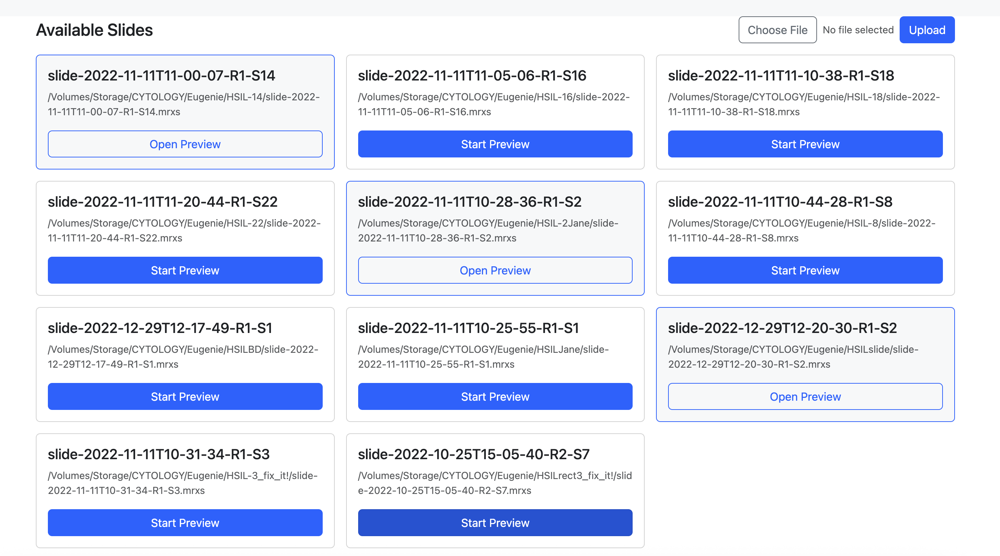

# Cytologick

AI-powered research tool for cervical cytology analysis

Cytologick is a Python application for analyzing Pap smear slides using deep learning. It provides both a desktop GUI and an experimental web interface for viewing whole-slide images and running AI-assisted detection of cellular abnormalities.

> **Research Use Only**: This software is for research and educational purposes. It is not a medical device and should not be used for clinical diagnosis.


## Web UI Demo (experimental)




---

## Features

- **Slide Viewing**: Load and navigate whole-slide images (MRXS, SVS, TIFF, NDPI, etc.)
- **AI Inference**: U-Net segmentation for detecting LSIL, HSIL, ASCUS, ASCH
- **Desktop GUI**: PyQt5-based interface with region selection and analysis
- **Web Interface**: Flask-based deep zoom viewer with overlay annotations
- **Training Pipeline**: Train custom models with Mixup augmentation and Lovasz loss
- **C++ Desktop App**: Standalone native application with ONNX Runtime inference

---

## C++ Version (Standalone)

A standalone C++ version is available for users who prefer native performance without Python dependencies.

**Download pre-built binaries:** [GitHub Releases](https://github.com/Akaiko1/Cytologick/releases)

**Features:**

- Native Qt6 desktop application
- ONNX Runtime inference (CPU/GPU)
- No Python installation required

**Current limitations:**

- Only MRXS slide format is supported (SVS and other formats coming soon)

For build instructions and documentation, see [cpp/README.md](cpp/README.md).

---

## Quick Start

### 1. Installation

**Prerequisites:**

- Python 3.10+ (tested with Python 3.12)
- Conda (recommended) or pip

#### Step A: Install OpenSlide binaries

**Crucial Step**: The Python library `openslide-python` is just a wrapper. You MUST install the OpenSlide binaries separately for it to work.

| Platform | Command |
|----------|---------|
| **Windows** | Download from [GitHub releases](https://github.com/openslide/openslide-winbuild/releases), extract to `C:/openslide`, add bin path to `config.yaml` |
| **macOS** | `brew install openslide` |
| **Linux** | `apt-get install libopenslide0` (Debian/Ubuntu) or `dnf install openslide` (Fedora) |

#### Step B: Install Python environment

**Option 1: CPU-only (simplest)**

```bash
# Create environment
conda create -n cyto python=3.12
conda activate cyto

# Install all dependencies (CPU PyTorch)
pip install -r requirements-pytorch.txt

# Install OpenSlide Python bindings
conda install -c conda-forge openslide-python
```

**Option 2: GPU/CUDA (recommended for training)**

For GPU acceleration, install PyTorch with CUDA support first using the [official PyTorch installer](https://pytorch.org/get-started/locally/):

```bash
# Create environment
conda create -n cyto python=3.12
conda activate cyto

# Install PyTorch with CUDA (choose your CUDA version)
# CUDA 12.4:
pip install torch torchvision torchaudio --index-url https://download.pytorch.org/whl/cu124

# CUDA 12.1:
pip install torch torchvision torchaudio --index-url https://download.pytorch.org/whl/cu121

# CUDA 11.8:
pip install torch torchvision torchaudio --index-url https://download.pytorch.org/whl/cu118

# Then install remaining dependencies (PyTorch will be skipped)
pip install -r requirements-pytorch.txt

# Install OpenSlide Python bindings
conda install -c conda-forge openslide-python
```

**Verify GPU installation:**

```bash
python -c "import torch; print(f'CUDA available: {torch.cuda.is_available()}')"
```

*Note: Using conda for `openslide-python` helps resolve binary path issues automatically.*

### 2. Configure

This repo includes an example config file. Copy it to `config.yaml` and edit it to match your local paths.

```bash
cp config.example.yaml config.yaml
```

**Edit `config.yaml`:**

```yaml
general:
  # Path to the folder containing OpenSlide DLLs/binaries (Windows only)
  openslide_path: "C:/path/to/openslide/bin" 
  
  # Folder containing your .mrxs slide files
  hdd_slides: "D:/Research/Slides" 

neural_network:
  framework: pytorch

gui:
  slide_dir: "./current"
```

### 3. Run

```bash
# Desktop application
python run.py

# Web interface (experimental)
python run_web.py
```

### Runtime Layout (recommended)

For end-user runs (and for packaged builds), keep runtime files next to the app:

- `config.yaml` next to the executable (or run from a folder that contains it)
- `_main/` next to the executable (local `.pth` models live here)
- OpenSlide binaries installed and discoverable (see OpenSlide section above)

`config.yaml` is auto-detected from the current working directory or from the executable directory.

### Web UI Smoke Test

1. Start the server: `python run_web.py`
2. Open the main menu: `http://127.0.0.1:5001`
3. Click a slide in the menu.

Each opened slide spawns its own viewer on port `5002 + index` (e.g. `5002`, `5003`, ...).
The viewer URL uses `web.ip_exposed` from `config.yaml`.

---

## Project Structure

```text
Cytologick/
├── run.py                   # Desktop GUI entry point
├── run_web.py               # Web interface entry point
├── config.py                # Configuration defaults
├── config.yaml              # User configuration
│
├── clogic/                  # Core logic
│   ├── gui.py               # Desktop GUI (PyQt5)
│   ├── ai_pytorch.py        # Training pipeline
│   ├── inference_pytorch.py # PyTorch inference
│   ├── inference_utils.py   # Shared inference utilities
│   └── model_loading.py     # Model discovery
│
├── __web/                   # Web interface
│   ├── start_web.py         # Flask app entry
│   ├── deepzoom_server.py   # Tile server
│   └── __get_slide_roi.py   # ROI extraction
│
├── _main/                   # Model storage
│   └── _new_best.pth        # Best trained model
│
├── dataset/                 # Training data (generated)
│   ├── rois/                # Training images
│   └── masks/               # Training masks
│
└── current/                 # Slide files for GUI viewing
    └── *.mrxs
```

---

## Training Models

### Step 1: Prepare Annotations

1. Open slides in [ASAP](https://computationalpathologygroup.github.io/ASAP/)
2. Draw rectangles around cell groups (label as `rect N`)
3. Draw polygons around individual cells (label as LSIL, HSIL, etc.)
4. Save as XML alongside the slide file

You can use the included ASAP example annotation file as a reference:

- `annotation_example.xml` (ASAP XML format with `Rectangle` and `Spline` annotations)

### Step 2: Generate Dataset

```bash
# Extract annotations from ASAP XML files
python get_xmls.py

# Create training images and masks
python get_dataset.py
```

### Step 3: Train

```bash
# Train a new model from scratch
python model_new.py

# Continue training an existing model
python model_train.py
```

By default, `model_train.py` continues from the latest checkpoint (`_new_last.pth` if present).

**Training outputs** (saved to project root):

| File | Description |
| ---- | ----------- |
| `_new_best.pth` | Best model by validation IoU |
| `_new_final.pth` | Final model at training end |
| `_new_last.pth` | Latest checkpoint |
| `_new_epochNNN.pth` | Per-epoch checkpoints |

### Step 4: Deploy to GUI

Copy your trained model to the `_main/` folder:

```bash
cp _new_best.pth _main/_new_best.pth
```

The GUIs automatically look for models in this order:

1. `_main/_new_best.pth` (Primary)
2. `_main/_new_final.pth`
3. `_main/_new_last.pth`
4. `_main/model.pth` (Legacy)
5. Any `.pth` file in `_main/`

---

## Configuration Reference

The `config.yaml` file controls all settings.

### General

```yaml
general:
  openslide_path: "path/to/bin"   # Crucial for Windows
  hdd_slides: "path/to/slides"    # Storage path
  temp_folder: temp
```

### Neural Network

```yaml
neural_network:
  framework: pytorch
  dataset_folder: dataset
  masks_folder: masks
  images_folder: rois
  classes: 3
  image_shape: [128, 128]
  pt_lr: 1.0e-3
  pt_num_workers: -1
  labels:
    LSIL: 2
    HSIL: 2
    ASCUS: 2
    ASCH: 2
```

### GUI

```yaml
gui:
  slide_dir: ./current
  unet_pred_mode: direct      # 'direct', 'smooth', or 'remote'
  use_tta: false
```

### Web

```yaml
web:
  endpoint_url: http://remote-server:7500
  health_timeout: 1.5
  web_conf_threshold: 0.25    # Confidence threshold (0.0 - 1.0)
  fast_tiles: true            # Speed up preview generation
```

---

## Inference Modes

| Mode | Description |
| ---- | ----------- |
| `direct` | Fast local inference using PyTorch model |
| `smooth` | Smoother predictions with overlapping windows |
| `remote` | Send tiles to TensorFlow Serving endpoint |

The GUI shows cloud availability status and automatically falls back to local mode if remote is unavailable.

---

## Web Interface

The web interface (`run_web.py`) requires specific JavaScript libraries to function.

**Required Assets:**
Download these files and place them in the `__web/static/` directory.

- **jQuery**: download [jquery-3.7.1.min.js](https://code.jquery.com/jquery-3.7.1.min.js), save as `__web/static/jquery.js`.
- **OpenSeadragon**: download [openseadragon-bin-5.0.1.zip](https://github.com/openseadragon/openseadragon/releases/download/v5.0.1/openseadragon-bin-5.0.1.zip), extract `openseadragon.min.js` and save as `__web/static/openseadragon.js` (also extract the `images` folder to `__web/static/images`).
- **OpenSeadragon Scalebar**: download [openseadragon-scalebar.js](https://github.com/usnistgov/OpenSeadragonScalebar/raw/master/openseadragon-scalebar.js), save as `__web/static/openseadragon-scalebar.js`.

---

## Notes / Expected Warnings

- `tfs_connector` deprecation warnings are expected (TensorFlow Serving path is kept for compatibility; PyTorch is the primary framework).
- If OpenSlide is not installed correctly, both GUI and Web UI will fail to open slides.

⚠️ **If these files are missing, the web viewer will not load.**

---

## Cell Types

Cytologick focuses on cervical cytology patterns:

| Abbreviation | Full Name |
| ------------ | --------- |
| **LSIL** | Low-grade Squamous Intraepithelial Lesion |
| **HSIL** | High-grade Squamous Intraepithelial Lesion |
| **ASCUS** | Atypical Squamous Cells of Undetermined Significance |
| **ASCH** | Atypical Squamous Cells, Cannot Exclude HSIL |

---

## Technical Details

### Training Pipeline (PyTorch)

- **Model**: U-Net with EfficientNet-B3 encoder
- **Augmentation**: Mixup (alpha=0.4), rotation, affine transforms, noise
- **Loss**: Lovasz Softmax + Cross Entropy with Label Smoothing (0.1)
- **Optimizer**: NAdam with Cosine Annealing Warm Restarts
- **Mixed Precision**: Automatic Mixed Precision (AMP) enabled

### Dependencies

- PyTorch + segmentation_models_pytorch
- PyQt5 for desktop GUI
- Flask + OpenSlide for web interface
- OpenCV, NumPy, Albumentations

---

## Contributing

See `CONTRIBUTING.md` for guidelines.

## License

MIT License - see `LICENSE` for details.

---

*Cytologick is for research and educational use only. It is not intended for clinical diagnosis or treatment.*
