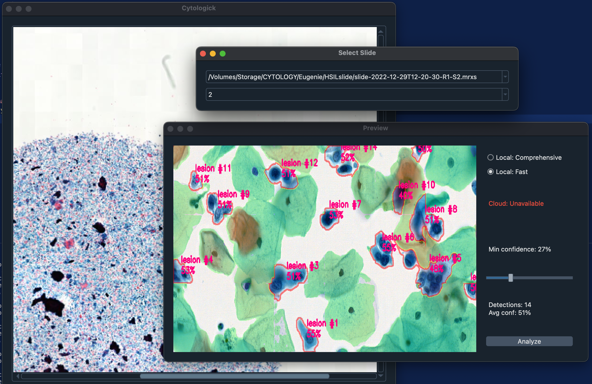

# Cytologick software (WIP)

## Overview

Cytologick is a Python-based software designed to automate the analysis of Pap smear scans using convolutional neural networks (CNNs). The project's codebase supports automatic dataset preparation and model training. After training and deploying the model, either locally or on the cloud, Cytologick offers visualization tools to identify and highlight unusual findings in the scans. This functionality assists users by providing detailed reports and visual annotations of the findings.

**Dependencies**

Web GUI is based on **OpenSeaDragon** and **jQuery**

https://openseadragon.github.io

https://jquery.com

## Precompiled packages and models

**Coming Soon**

## Instructions

To start GUI run

- run.py

- run_web.py
  
  web interface uses **only** tf-serving hosted models
  
  **gui** is capable to use local models and cloud based models

Temporarily, the fastest way to connect software to cloud hosted AI model is to alter function located in clogic\inference.py - **apply_remote**, you need to change endpoint and model name parameters (**tf-serve** **name**)

GUI is running cloud-based model example:



Temporarily, to use local model you need to create folder "_main" in the same folder as run.py and place tensorflow files there, the software will load them automatically, if the local file is absent - only cloud options will be enabled (hosted tf-serving model)

Place **MRXS** slide files in 'current' folder for GUI to locate them or change the folder name in config.py

The software is compatible with ASAP tool and is able to process segmentation in that format and produce a local dataset

[ASAP - Automated Slide Analysis Platform](https://computationalpathologygroup.github.io/ASAP/)

The ML chain that forms dataset and trains AI model is:

- Set the config.py parameters as desired, HDD_SLIDES - the path to segmented slides folder

- After that chain scripts: **get_xmls**.py -> **get_dataset**.py -> **model_new**.py -> **model_train**.py

## Project Structure

- `config.py` - Configuration settings for the project.
- `clogic/` - Contains main modules.
- `get_dataset.py` - Script to prepare the dataset.
- `model_new.py`, `model_train.py` - Scripts for model definition and training.
- `parsers/` - Modules for parsing SVS or MRSX data.
- `tfs_connector/` - Contains modules that connects software to cloud deployed models.
- `run.py`, `run_web.py` - Main executable scripts.

## Installation from source

1. Install **Conda** and create a new environment with **python3**, version **3.10.6** or later

2. Install Openslide from <https://openslide.org> refer to the manual corresponding to your current OS

3. Download (links are in the Overview section) and place to __web/static
   - __web/static/**jquery.js**
   - __web/static/**openseadragon-scalebar.js**
   - __web/static/**openseadragon.js**

4. Activate new env with **cmd** or **powershell** in local folder

5. Run command in terminal:
   
   ```bash
   pip install -r requirements.txt
   ```

6. Also run in your activated environment:
   
   ```bash
   conda install tensorflow
   conda install openslide-python # optional if run.py doesn't work
   ```

7. Modify settings at config.py (debug config file with auxillary parameters, a subject to change later)
   
   **OPENSLIDE_PATH** is necessary! This is an absolute path to your OpenSlide installation folder
   
   ```python
   #region General
   # CURRENT_SLIDE = 'current\slide-2022-11-11T11-10-38-R1-S18.mrxs'
   CURRENT_SLIDE = os.path.abspath('slide-2022-09-12T15-38-25-R1-S2.mrxs') # 'current\slide-2022-09-12T15-38-25-R1-S2.mrxs'
   CURRENT_SLIDE_XML = 'current\slide-2022-09-12T15-38-25-R1-S2\Data0021.dat'
   OPENSLIDE_PATH = os.path.abspath('openslide\\bin') # 'E:\\Github\\DemetraAI\\openslide\\bin'
   HDD_SLIDES = os.path.abspath('current')
   HDD_SLIDES_SVS = 'CYTOLOGY_2'
   TEMP_FOLDER = 'temp'
   #endregion
   
   #region Neural Network
   DATASET_FOLDER = 'dataset'
   MASKS_FOLDER = 'masks' # Inside DATASET_FOLDER
   IMAGES_FOLDER = 'rois' # Inside DATASET_FOLDER
   IMAGE_CHUNK = (256, 256)
   IMAGE_SHAPE = (128, 128)
   CLASSES = 3
   LABELS = {
      'LSIL': 2,
      'HSIL': 2,
      'Group HSIL': 2,
      'ASCH': 2,
      'Group atypical': 2,
      'ASCUS': 2,
      'Atypical': 2,
      'Atypical naked': 2,
   } 
   #endregion
   
   #region GUI
   SLIDE_DIR = './current' # Only for GUI
   UNET_PRED_MODE = 'remote' # 'smooth', 'direct'
   #endregion
   
   #region Dataset
   EXCLUDE_DUPLICATES = False
   BROADEN_INDIVIDUAL_RECT = 1000
   #endregion
   
   #region Web
   IP_EXPOSED = '127.0.0.1'
   #endregion
   ```

## Contributing

If you're interested in contributing to Cytologick, please read our contributing guidelines. We welcome issues and pull requests!
